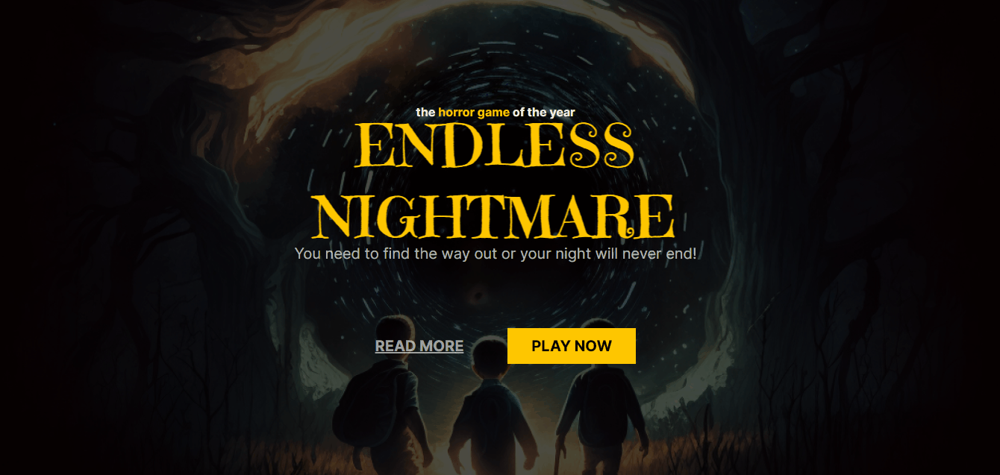
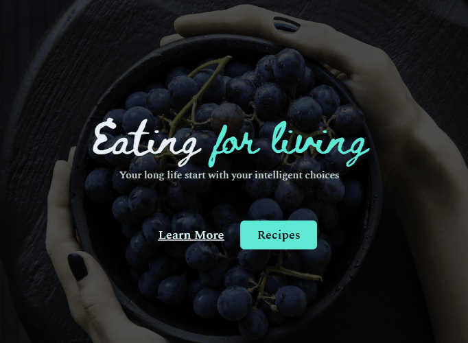

#  🏆 Journey from zero to first  job (Jornada do zero a primeira vaga)

This repository is part of a recent Rocketseat event where participants were challenged to develop three landing pages using only HTML and CSS within a three-day timeframe.  
Teacher Mayk Brito also provides numerous tips on career development, study management, and soft skills improvement.  

 You can check the layout here 🔗[Layout 1](https://www.figma.com/community/file/1217611263175712052)
[challenges 2 and 3](https://www.figma.com/community/file/1217611263175712052)
## 🚀 My latest updates include:

- Addition of favicons to the webpages
- Incorporation of animations to enhance the pages
- Inclusion of settings.json and CSS snippets for improved functionality.

## 🛠️ Technology

Project developed with these technologies:

- HTML e CSS
- Git e Github

## 🔎 Preview project 1

## 🔎 Preview project 2

## 🔎 Preview project 3

##   💻 Contact me

 
  

 Made by [**Amandatec**](https://www.linkedin.com/in/amanda-oliveira-20/">)

